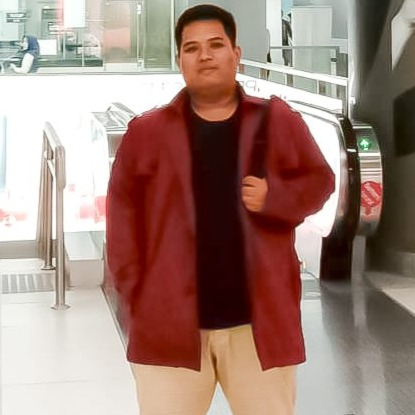

# Anggih Pratama Profile

> This is made on purpose of fulfilling the week 0 assignment for "My Profile"

## My Bio

Hi, I'm Anggih. Student of RevoU FSSE Madrid 2023.

I'm a mathematics lover that wish to develop myself using this ability that I love the most to be the next Software Engineer.

My career right now is as Customer Service English at Start Up Financial Singapore Company, It's called Payfazz StraitsX. 

I am a person who really values friendship. My friends have careers in various fields, and my college friends was choosing Software Engineer as their career. I thought I also wanted to get into that career, but I needed a teacher who could help direct me towards that goal.

I was late to be there, but I believe it's never too late to learn as long as there is a desire.

I hope my brother, Lindo, will proud of me.

[def]: assets/Anggih.jpeg

## My Links

- GitHub: [@AnggihP](https://github.com/AnggihP)
- Twitter: [@aanggihpratama](https://twitter.com/aanggihpratama)
- Instagram: [@aanggihpratama](http://instagram.com/aanggihpratama/)
- LinkedIn: [Anggih Pratama](https://www.linkedin.com/in/anggih-pratama-3ab23b142/)

## My Hobby

1. Sport 
2. Movies
3. Anime
4. Dramas

## My Favorite Links
| Name    | URL                   | Reason                         |
| ------- | --------------------- | ------------------------------ |
| Telegram  | <https://web.telegram.org>  | To watch out unpaid movies and dramas            |
| Youtube  | <https://www.youtube.com/>  | To watch examples, tutorials, and entertainment |
| WhatsApp | <https://web.whatsapp.com/> | To keep in touch with friends and colleague       |